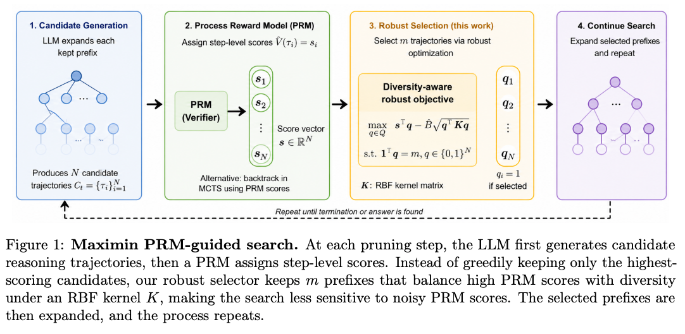
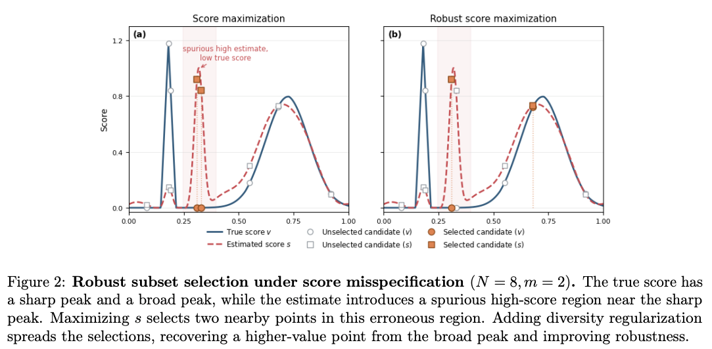
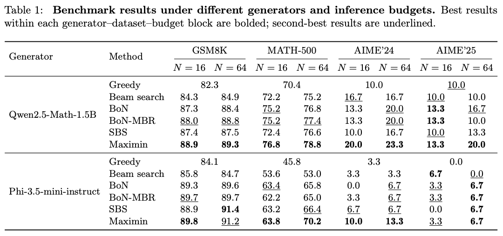

# Mitigating Over-Optimization in PRM-Guided Search in Mathematical Reasoning by Optimizing the Guide

Official implementation of **Maximin Search**, a step-level PRM-guided search that mitigates reward over-optimization in PRM-guided search by jointly optimizing for quality and diversity.

> [**Parper link**](#) | [](LICENSE)


---

## Overview

Process Reward Models (PRMs) are commonly used to guide search in mathematical reasoning, but pure score maximization with a fixed PRM tends to collapse onto a narrow set of similar solutions — a form of reward hacking driven by score misspecification.

**Maximin Search** addresses this by framing trajectory selection as a kernel-regularized optimization problem that balances PRM score against diversity, measured via hidden-state embeddings from the PRM itself.

<p align="center">
  
</p>

At each search step, Maximin:
1. Generates `branching_factor` candidate continuations per live trajectory.
2. Scores all candidates with the PRM.
3. Selects the surviving subset by solving a diversity-aware robust objective that maximizes scores subject to an RBF kernel repulsion penalty.

When `branching_factor=1` and `repulsive_factor=0`, the algorithm reduces to standard **Best-of-N** sampling with PRM re-ranking.

The motivation for diversity regularization is illustrated below: when PRM scores are misspecified, greedy selection clusters around a spurious high-score region. Maximin spreads selections to recover better solutions from elsewhere.

<p align="center">
  
</p>

## Requirements

```bash
conda env create -f Maximin.yml
conda activate maximin
```

You will also need a Hugging Face access token for gated models:

```bash
export HF_TOKEN=your_token_here
```

**Models used in the paper:**
- Generator: `Qwen/Qwen2.5-Math-1.5B`, `microsoft/Phi-3.5-mini-instruct`
- PRM: `Skywork/Skywork-o1-Open-PRM-Qwen-2.5-1.5B`

## Repository Structure

```
src/
├── main.py           # Entry point: benchmarking loop with resume support
├── generator.py      # StepDecode (Maximin Search) and BeamSearch
├── greedy_solver.py  # Kernel subset selection (repulsive pruning)
├── utils.py          # RBF kernel, seeding, answer parsing
├── save_utils.py     # Run ID, logging, resume utilities
├── skywork_prm/      # Vendored Skywork-o1 PRM inference code (do not edit)
│   ├── prm_model.py      # PRM wrapper
│   ├── modeling_base.py  # Pretrained-model wrapper base class
│   └── io_utils.py       # PRM input formatting and reward extraction
└── qwen_eval/        # Vendored Qwen2.5-Math evaluation code (do not edit)
    ├── grader.py         # math_equal evaluation
    └── parser.py         # Answer extraction from model output
print_result.py       # Summarize and print benchmark results
```

The `skywork_prm/` and `qwen_eval/` packages hold vendored upstream code,
grouped by origin. Their modules are kept verbatim (flat absolute imports and
all), so each package's `__init__.py` adjusts `sys.path` and re-exports the
symbols used by `generator.py` / `main.py`. Treat these two folders as
read-only when modifying the project.

## Usage

**Maximin Search** (with repulsive diversity regularization):
```bash
CUDA_VISIBLE_DEVICES=0 python src/main.py \
    --dataset math500 \
    --model Qwen/Qwen2.5-Math-1.5B \
    --batch_size 16 \
    --branching_factor 4 \
    --repulsive_factor 1.0 \
    --prm \
    --output_dir results
```

**Step-level beam search** (PRM-guided, no diversity):
```bash
CUDA_VISIBLE_DEVICES=0 python src/main.py \
    --dataset math500 \
    --model Qwen/Qwen2.5-Math-1.5B \
    --batch_size 16 \
    --branching_factor 4 \
    --repulsive_factor 0.0 \
    --prm \
    --output_dir results
```

**Best-of-N** (`branching_factor=1`: all `batch_size` solutions generated independently, PRM picks top-1):
```bash
CUDA_VISIBLE_DEVICES=0 python src/main.py \
    --dataset math500 \
    --model Qwen/Qwen2.5-Math-1.5B \
    --batch_size 16 \
    --branching_factor 1 \
    --repulsive_factor 0.0 \
    --prm \
    --output_dir results
```

**Beam search baseline** (no PRM):
```bash
CUDA_VISIBLE_DEVICES=0 python src/main.py \
    --dataset math500 \
    --model Qwen/Qwen2.5-Math-1.5B \
    --batch_size 16 \
    --use_beam \
    --output_dir results
```

### Multi-GPU (data-parallel over examples)

For multiple GPUs, launch one process per GPU with `torchrun`. The benchmark is
embarrassingly parallel: each rank holds a full copy of the generator and PRM,
evaluates a disjoint shard of the dataset (`idx % world_size == rank`), and
streams to its own `outputs.rank{r}.jsonl` inside a shared run directory. No
gradient synchronization is involved.

```bash
torchrun --nproc_per_node=4 src/main.py \
    --dataset math500 \
    --model Qwen/Qwen2.5-Math-1.5B \
    --batch_size 16 \
    --branching_factor 4 \
    --repulsive_factor 1.0 \
    --prm \
    --output_dir results
```

Each rank reports its local accuracy; rank 0 prints the aggregated `[GLOBAL]`
accuracy across shards at the end. Running with plain `python` (no `torchrun`)
falls back to single-GPU behavior unchanged. `print_result.py` merges all
`outputs*.jsonl` shards per run automatically.

### Key arguments

| Argument | Default | Description |
|---|---|---|
| `--dataset` | `gsm8k` | `gsm8k`, `math500`, `aime2024`, `aime2025` |
| `--batch_size` | `1` | Total solution budget per problem |
| `--branching_factor` | `4` | Children per node. `1` = Best-of-N |
| `--repulsive_factor` | `0` | Diversity regularization strength. `0` = standard beam |
| `--prm` | flag | Enable PRM scoring and pruning |
| `--max_depth` | `30` | Maximum number of reasoning steps |
| `--step_max_new_tokens` | `128` | Max tokens per step |
| `--parallel_chunk_budget` | `-1` | Max candidates scored/generated per forward pass. `-1` uses `batch_size` (maximum throughput); set a smaller positive value if you hit OOM. |

### Printing results

After running, summarize a results directory with:

```bash
python print_result.py --results_dir results_math500_qwen25_math_15b --min_lines 5
```

This scans all run subdirectories, deduplicates examples, and prints a table of accuracy (RM top-1 and majority vote), format error rate, and run metadata. Runs with fewer than `--min_lines` completed examples are skipped.

## Results

<p align="center">
  
</p>

Maximin consistently outperforms Best-of-N, beam search, and step-level beam search (SBS) across both generators and all four benchmarks.

## Resuming Interrupted Runs

Results are streamed to a `.jsonl` file after each example. If a run is interrupted, re-running the same command will automatically resume from the last completed example.

## Acknowledgements

Parts of this codebase are adapted from the following repositories:

- `qwen_eval/` (`grader.py`, `parser.py`) — adapted from [Qwen2.5-Math](https://github.com/QwenLM/Qwen2.5-Math/blob/main/evaluation/grader.py) (Qwen Team, Alibaba)
- `skywork_prm/` (`prm_model.py`, `modeling_base.py`, `io_utils.py`) — adapted from [skywork-o1-prm-inference](https://github.com/SkyworkAI/skywork-o1-prm-inference/tree/main/model_utils) (Skywork AI)

Each file retains the original source URL in its header comment.